# Diagrama DER Actualizado - Sistema DIPIDE
## Sistema de Soluciones Informáticas Modulares

> **IMPORTANTE**: Este esquema de base de datos es una versión preliminar basada en el análisis inicial de requerimientos. Evolucionará durante el desarrollo conforme se obtenga mayor detalle de los requerimientos específicos de DIPIDE y feedback de los usuarios finales.

## Demo Funcional

Un prototipo funcional de este sistema está disponible en **[dipide.gabrielsuarez.ar](https://dipide.gabrielsuarez.ar)** que demuestra la implementación práctica de estas entidades y relaciones.

```mermaid
erDiagram
    USUARIO {
        int id PK
        string nombre
        string email
        string telefono
        string username UK
        string password_hash
        int unidad_organizacional_id FK
        string estado
        datetime fecha_creacion
        datetime ultima_sesion
        boolean activo
    }

    UNIDAD_ORGANIZACIONAL {
        int id PK
        string codigo UK
        string nombre
        string descripcion
        string responsable
        boolean activa
        datetime fecha_creacion
    }

    ROL {
        int id PK
        string codigo UK
        string nombre
        string descripcion
        json permisos
        boolean activo
        datetime fecha_creacion
    }

    USUARIO_ROL {
        int id PK
        int usuario_id FK
        int rol_id FK
        int unidad_organizacional_id FK
        string contexto
        datetime fecha_asignacion
        boolean activo
    }

    EXPEDIENTE {
        int id PK
        string numero UK
        string cliente
        string producto_servicio
        string descripcion
        string estado
        string tramo_actual
        int unidad_origen_id FK
        int unidad_actual_id FK
        int usuario_responsable_id FK
        decimal costo_estimado
        datetime fecha_inicio
        datetime fecha_estimada_fin
        datetime fecha_fin_real
        texto observaciones
        json metadata
        datetime fecha_creacion
        datetime fecha_actualizacion
    }

    ORDEN_TRABAJO {
        int id PK
        string numero UK
        int expediente_id FK
        string tipo_orden
        string descripcion
        string estado
        string prioridad
        int unidad_asignada_id FK
        int usuario_responsable_id FK
        decimal horas_estimadas
        decimal horas_reales
        datetime fecha_programada
        datetime fecha_inicio_real
        datetime fecha_fin_real
        texto observaciones
        datetime fecha_creacion
        datetime fecha_actualizacion
    }

    ESTADO_WORKFLOW {
        int id PK
        string codigo UK
        string nombre
        string descripcion
        string tipo_entidad
        string tramo
        int orden_secuencial
        boolean es_inicial
        boolean es_final
        json transiciones_permitidas
        string color_hex
        datetime fecha_creacion
    }

    MOVIMIENTO_WORKFLOW {
        int id PK
        string entidad_tipo
        int entidad_id
        int estado_anterior_id FK
        int estado_nuevo_id FK
        int usuario_id FK
        int unidad_organizacional_id FK
        string motivo
        texto observaciones
        json datos_adicionales
        datetime fecha_movimiento
        datetime fecha_creacion
    }

    CATEGORIA_INSUMO {
        int id PK
        string codigo UK
        string nombre
        string descripcion
        string tipo
        int categoria_padre_id FK
        boolean activa
        datetime fecha_creacion
    }

    INSUMO {
        int id PK
        string codigo UK
        string nombre
        string descripcion
        int categoria_id FK
        string unidad_medida
        string ubicacion_almacen
        decimal stock_actual
        decimal stock_minimo
        decimal stock_maximo
        decimal precio_unitario_promedio
        string estado_stock
        boolean requiere_lote
        boolean activo
        json especificaciones
        datetime fecha_creacion
        datetime fecha_actualizacion
    }

    PROVEEDOR {
        int id PK
        string codigo UK
        string nombre
        string razon_social
        string cuit
        string direccion
        string telefono
        string email
        string contacto_principal
        string estado_proveedor
        decimal calificacion
        json datos_facturacion
        boolean activo
        datetime fecha_creacion
        datetime fecha_actualizacion
    }

    PROVEEDOR_INSUMO {
        int id PK
        int proveedor_id FK
        int insumo_id FK
        decimal precio_actual
        decimal precio_historico_promedio
        int tiempo_entrega_dias
        decimal cantidad_minima_pedido
        boolean proveedor_principal
        string estado_relacion
        datetime fecha_ultima_compra
        datetime fecha_actualizacion
    }

    MOVIMIENTO_STOCK {
        int id PK
        int insumo_id FK
        int usuario_id FK
        int unidad_organizacional_id FK
        string tipo_movimiento
        decimal cantidad
        decimal stock_anterior
        decimal stock_resultante
        decimal precio_unitario
        int expediente_id FK
        int orden_trabajo_id FK
        int orden_compra_id FK
        string lote
        datetime fecha_vencimiento
        string motivo
        texto observaciones
        json metadata
        datetime fecha_movimiento
        datetime fecha_registro
    }

    ORDEN_COMPRA {
        int id PK
        string numero UK
        int proveedor_id FK
        int usuario_solicitante_id FK
        int unidad_solicitante_id FK
        string estado
        string prioridad
        decimal subtotal
        decimal impuestos
        decimal total
        datetime fecha_solicitud
        datetime fecha_aprobacion
        datetime fecha_orden
        datetime fecha_entrega_estimada
        datetime fecha_entrega_real
        texto observaciones
        json condiciones_pago
        datetime fecha_creacion
        datetime fecha_actualizacion
    }

    DETALLE_ORDEN_COMPRA {
        int id PK
        int orden_compra_id FK
        int insumo_id FK
        decimal cantidad_solicitada
        decimal cantidad_recibida
        decimal precio_unitario
        decimal subtotal
        string estado_item
        datetime fecha_recepcion
        string lote_recibido
        texto observaciones
    }

    ALERTA_SISTEMA {
        int id PK
        string tipo_alerta
        string codigo_referencia
        int entidad_id
        string entidad_tipo
        string mensaje
        string nivel_prioridad
        string estado
        int usuario_creador_id FK
        int usuario_asignado_id FK
        int unidad_organizacional_id FK
        json datos_contexto
        datetime fecha_creacion
        datetime fecha_vencimiento
        datetime fecha_resolucion
        texto notas_resolucion
    }

    AUDITORIA {
        int id PK
        string tabla_afectada
        int registro_id
        string operacion
        int usuario_id FK
        string ip_origen
        json valores_anteriores
        json valores_nuevos
        string motivo
        datetime timestamp
        string session_id
    }

    CONFIGURACION_SISTEMA {
        int id PK
        string clave UK
        string categoria
        string valor
        string tipo_dato
        string descripcion
        int usuario_modificacion_id FK
        datetime fecha_modificacion
        boolean es_publico
    }

    REPORTE {
        int id PK
        string nombre
        string tipo_reporte
        string categoria
        int usuario_id FK
        int unidad_organizacional_id FK
        json parametros
        string formato_salida
        string estado
        string archivo_generado
        decimal tiempo_generacion_seg
        datetime fecha_solicitud
        datetime fecha_generacion
        datetime fecha_vencimiento
    }

    %% Relaciones principales
    USUARIO }|--|| UNIDAD_ORGANIZACIONAL : pertenece_a
    USUARIO_ROL }|--|| USUARIO : asignado_a
    USUARIO_ROL }|--|| ROL : tiene_rol
    USUARIO_ROL }|--|| UNIDAD_ORGANIZACIONAL : en_contexto
    
    EXPEDIENTE }|--|| UNIDAD_ORGANIZACIONAL : origen
    EXPEDIENTE }|--|| UNIDAD_ORGANIZACIONAL : ubicacion_actual
    EXPEDIENTE }|--|| USUARIO : responsable
    
    ORDEN_TRABAJO }|--|| EXPEDIENTE : pertenece_a
    ORDEN_TRABAJO }|--|| UNIDAD_ORGANIZACIONAL : asignada_a
    ORDEN_TRABAJO }|--|| USUARIO : responsable
    
    MOVIMIENTO_WORKFLOW }|--|| ESTADO_WORKFLOW : estado_anterior
    MOVIMIENTO_WORKFLOW }|--|| ESTADO_WORKFLOW : estado_nuevo
    MOVIMIENTO_WORKFLOW }|--|| USUARIO : ejecutado_por
    MOVIMIENTO_WORKFLOW }|--|| UNIDAD_ORGANIZACIONAL : en_unidad
    
    INSUMO }|--|| CATEGORIA_INSUMO : pertenece_a
    CATEGORIA_INSUMO }|--o| CATEGORIA_INSUMO : categoria_padre
    
    PROVEEDOR_INSUMO }|--|| PROVEEDOR : proveedor
    PROVEEDOR_INSUMO }|--|| INSUMO : insumo
    
    MOVIMIENTO_STOCK }|--|| INSUMO : afecta
    MOVIMIENTO_STOCK }|--|| USUARIO : registrado_por
    MOVIMIENTO_STOCK }|--|| UNIDAD_ORGANIZACIONAL : en_unidad
    MOVIMIENTO_STOCK }|--o| EXPEDIENTE : relacionado_con
    MOVIMIENTO_STOCK }|--o| ORDEN_TRABAJO : relacionado_con
    MOVIMIENTO_STOCK }|--o| ORDEN_COMPRA : relacionado_con
    
    ORDEN_COMPRA }|--|| PROVEEDOR : dirigida_a
    ORDEN_COMPRA }|--|| USUARIO : solicitada_por
    ORDEN_COMPRA }|--|| UNIDAD_ORGANIZACIONAL : para_unidad
    ORDEN_COMPRA ||--o{ DETALLE_ORDEN_COMPRA : contiene
    
    DETALLE_ORDEN_COMPRA }|--|| INSUMO : incluye
    
    ALERTA_SISTEMA }|--|| USUARIO : creada_por
    ALERTA_SISTEMA }|--o| USUARIO : asignada_a
    ALERTA_SISTEMA }|--|| UNIDAD_ORGANIZACIONAL : para_unidad
    
    AUDITORIA }|--|| USUARIO : ejecutada_por
    
    CONFIGURACION_SISTEMA }|--|| USUARIO : modificada_por
    
    REPORTE }|--|| USUARIO : solicitado_por
    REPORTE }|--|| UNIDAD_ORGANIZACIONAL : para_unidad
```

## Entidades Clave del Sistema DIPIDE

### EXPEDIENTE
Entidad central que representa el proceso GO.001.001 de DIPIDE, con seguimiento completo a través de los 8 TRAMOS del workflow organizacional (Comercialización, Producción, Almacén, Transporte).

### ORDEN_TRABAJO
Tareas específicas derivadas de expedientes, permitiendo granularidad en la gestión operativa con asignación por unidades funcionales.

### MOVIMIENTO_WORKFLOW  
Trazabilidad completa de cambios de estado tanto para expedientes como órdenes de trabajo, con audit trail automático.

### UNIDAD_ORGANIZACIONAL
Estructura organizacional de DIPIDE (Comercialización, Producción, Almacén, Transporte) con contexto para permisos y responsabilidades.

### SISTEMA RBAC
Control de acceso basado en roles con contexto organizacional, permitiendo usuarios multi-funcionales según los requerimientos de DIPIDE.

### GESTIÓN DE INVENTARIO
Control de insumos y materiales con estados configurables, movimientos cronológicos y trazabilidad completa sin eliminación de registros.

## Características del Diseño

### Trazabilidad y Auditoría
- **Audit trail automático**: Tabla AUDITORIA registra todos los cambios con usuario, timestamp y valores
- **Movimientos persistentes**: MOVIMIENTO_STOCK nunca se elimina, solo ajustes correctivos
- **Workflow completo**: MOVIMIENTO_WORKFLOW rastrea cada cambio de estado

### Flexibilidad Operativa  
- **Estados configurables**: ESTADO_WORKFLOW permite definir flujos por tipo de entidad
- **Metadata JSON**: Campos JSON para requisitos futuros sin cambios estructurales
- **Configuración dinámica**: CONFIGURACION_SISTEMA para parámetros operativos

### Integración Futura
- **Campos preparatorios**: Estructura lista para web services y integraciones externas  
- **Escalabilidad**: Diseño preparado para múltiples instalaciones gubernamentales
- **Modularidad**: Entidades independientes pero interconectadas

### Cumplimiento de Requerimientos
- **8 TRAMOS del proceso**: Estados y transiciones configurables
- **4 Unidades organizacionales**: Estructura jerárquica flexible
- **Import/Export CSV**: Estructura preparada para carga masiva
- **Reportes configurables**: REPORTE con parámetros JSON flexibles

## Evolución del Esquema

Este diagrama representa la comprensión actual de los requerimientos DIPIDE basado en:
- Análisis de la propuesta técnica
- Implementación del prototipo funcional
- Procesos organizacionales GO.001.001 identificados

**El esquema evolucionará durante el desarrollo mediante**:
- Feedback de usuarios finales de DIPIDE
- Refinamiento de procesos específicos por unidad
- Requisitos de integración con sistemas existentes  
- Optimizaciones de performance identificadas durante testing

---

*Para ver este esquema en funcionamiento, visite el demo funcional en [dipide.gabrielsuarez.ar](https://dipide.gabrielsuarez.ar)*