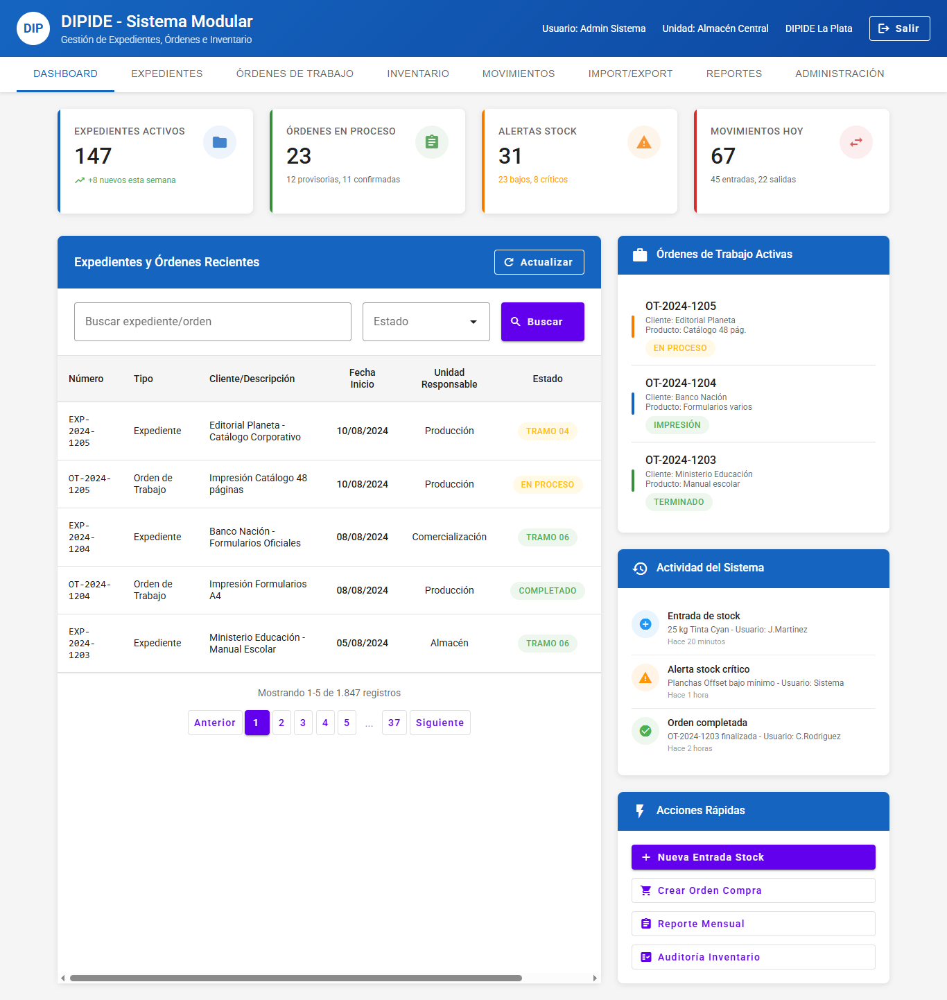
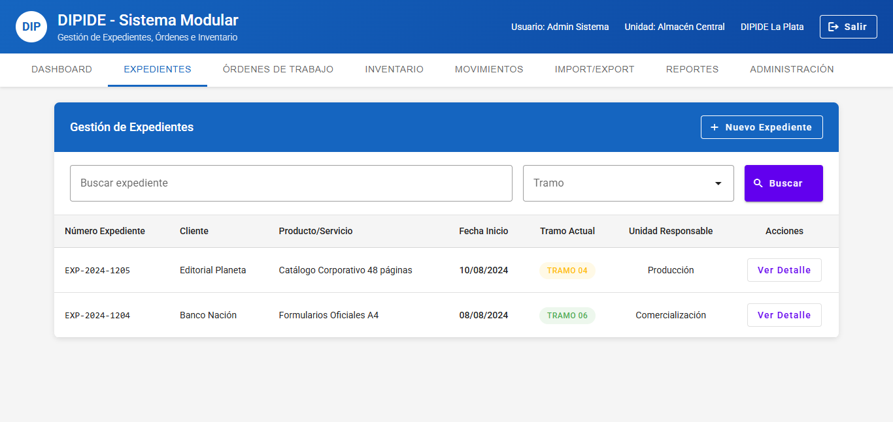

# PROPUESTA TÉCNICA - DIPIDE
## Sistema de Soluciones Informáticas Modulares

**Equipo de desarrollo:**
- **Claudio Alejandro Paz** - Desarrollador Full Stack (alejandro30.11.2007@gmail.com)
- **Gabriel Ernesto Suárez** - Especialista en Backend y Seguridad (gabrielxsuarez@gmail.com)  
- **Adriana Noelia Aguirre** - Analista Funcional y UX/UI (adriana.aguirre88@gmail.com)

**Diseño orientativo:** Una primera propuesta visual de interfaces está disponible en **[dipide.gabrielsuarez.ar](https://dipide.gabrielsuarez.ar)** para facilitar la comprensión de los conceptos técnicos planteados. Esta implementación preliminar evolucionará significativamente durante el desarrollo.

---

## SECCIÓN 1: OBJETIVOS GENERALES DE INTEGRACIÓN

### OBJETIVO GENERAL 01 ~ GESTIÓN DE DATOS DE SOPORTE (CRUD)

#### 01.01 - GESTIÓN DE DATOS DE ENTIDADES INFORMÁTICAS

**Alcance técnico:**
Desarrollo de sistema semi-automatizado para administración de datos maestros mediante importación/exportación de archivos CSV. El sistema priorizará la consistencia de datos y permitirá gestión por lotes sin requerir conocimientos técnicos avanzados.

**Implementación propuesta:**
- **Backend Go Fiber**: Endpoints REST para procesamiento de archivos CSV con validación automática de estructura y encoding UTF-8
- **Formato CSV**: Separador configurable (tabulador por defecto para evitar conflictos con descripciones)
- **Validación robusta**: Transacciones PostgreSQL con atomicidad completa - si la consistencia peligra, la importación falla completamente
- **Capacidad de procesamiento**: Hasta decenas de miles de registros por lote sin complejizar la arquitectura
- **Preview de importación**: Vista previa de datos antes de confirmar cambios
- **Logs detallados**: Registro completo de errores y operaciones exitosas

**Funcionalidades incluidas:**
- Importación masiva con mapeo de campos configurable
- Exportación completa de tablas como backup
- ABM semi-automatizado usando IDs internos del sistema
- Interfaz web intuitiva para usuarios no técnicos

*Una propuesta visual de estas interfaces está disponible en el módulo "Import/Export" de [dipide.gabrielsuarez.ar](https://dipide.gabrielsuarez.ar) como ejemplo conceptual del diseño previsto para validación de archivos, historial de operaciones y manejo de errores.*

#### 01.02 - GESTIÓN DE DATOS DE REGISTROS RELACIONALES

**Alcance técnico:**
Sistema de gestión de tablas de vinculación con garantías de integridad referencial mediante tecnología de base de datos robusta.

**Implementación propuesta:**
- **Nivel de aislamiento SERIALIZABLE**: Prevención de condiciones de carrera en operaciones concurrentes
- **Triggers automáticos**: Validación de integridad referencial en tiempo real
- **Procedures almacenados**: Para operaciones complejas que involucren múltiples tablas relacionales
- **Sistema de locks optimistas**: Gestión eficiente de concurrencia sin bloqueos prolongados

### OBJETIVO GENERAL 02 ~ TRAZABILIDAD DE PROCESOS

#### 02.01 - TRAZABILIDAD DE GESTIÓN (EXPEDIENTES)
#### 02.02 - TRAZABILIDAD DE GESTIÓN (ÓRDENES DE TRABAJO)

**Alcance técnico:**
Implementación de sistema completo de auditoría y seguimiento basado en la estructura documental existente de DIPIDE, con capacidad de búsqueda por expedientes y órdenes.

**Implementación propuesta:**
- **Timestamps con zona horaria**: Registro usando PostgreSQL timestamptz para precisión temporal
- **Campos de trazabilidad**: fecha_creacion, fecha_actualizacion, cambios_estado, acciones_usuario, movimientos_inventario
- **Sistema de auditoría automático**: Triggers que registran automáticamente todos los cambios con usuario, timestamp, valores anteriores/nuevos, e IP de origen
- **Búsqueda flexible**: Consultas por número de expediente, número de orden, rangos de fechas
- **Retención configurable**: Sistema de archivado de logs con políticas definibles por administrador

### OBJETIVO GENERAL 03 ~ ESTADOS DE GESTIÓN Y CONTROL

#### 03.01 - ESTADOS DE GESTIÓN Y CONTROL (EXPEDIENTES)
#### 03.02 - ESTADOS DE GESTIÓN Y CONTROL (ÓRDENES)

**Alcance técnico:**
Máquina de estados configurable que permita seguimiento diferenciado de expedientes y órdenes de trabajo, con validación automática de transiciones permitidas.

**Implementación propuesta:**
- **Enum types PostgreSQL**: Estados definidos a nivel de base de datos para consistencia
- **Validación de transiciones**: Triggers que verifican automáticamente transiciones permitidas
- **Configuración JSON**: Diagramas de estados almacenados en formato JSON configurable
- **Validación en Go Fiber**: Backend valida transiciones antes de cada cambio de estado
- **Estados diferenciados**: Gestión independiente para expedientes vs. órdenes de trabajo
- **Filtros avanzados**: Consultas por estado, rango de fechas, unidad organizacional

### OBJETIVO GENERAL 04 ~ GESTIÓN DE MOVIMIENTOS Y ESTADOS DE INVENTARIO

#### 04.01 - MOVIMIENTOS Y ESTADOS DE INVENTARIO (INSUMOS)
#### 04.02 - MOVIMIENTOS Y ESTADOS DE INVENTARIO (MATERIALES)  
#### 04.03 - MOVIMIENTOS Y ESTADOS DE INVENTARIO (TRABAJOS TERMINADOS)

**Alcance técnico:**
Sistema integral de control de inventario con seguimiento cronológico de movimientos, diferenciación de tipos de productos y estados configurable.

**Implementación propuesta:**
- **Control cronológico**: Cada consulta de stock toma último punto de control hacia atrás y suma movimientos posteriores
- **Estados de inventario**: DISPONIBLE, RESERVADO, EN_PROCESO, DEFECTUOSO, BLOQUEADO, EN_TRANSITO (configurables)
- **Persistencia completa**: Ningún movimiento se elimina - solo se registran movimientos de ajuste correctivos
- **Auditoría automática**: Cada cambio de estado genera registro automático con timestamp y usuario responsable
- **Tipos de movimiento configurables**: Sistema flexible para ingreso/egreso con multiplicadores automáticos
- **Priorización**: Materiales (prioridad alta), Insumos (media), Trabajos terminados (baja)

### OBJETIVO GENERAL 05 ~ PLANES DE REPOSICIÓN DE INVENTARIO

#### 05.01 - PLANES DE REPOSICIÓN (INSUMOS)
#### 05.02 - PLANES DE REPOSICIÓN (MATERIALES)
#### 05.03 - PLANES DE REPOSICIÓN (TRABAJOS TERMINADOS)

**Alcance técnico:**
Sistema híbrido de alertas automáticas con configuración administrativa de parámetros de reposición.

**Implementación propuesta:**
- **Jobs programados**: Go Fiber con revisión diaria de stocks mínimos mediante cron jobs
- **Alertas configurables**: Notificaciones automáticas por stock bajo (email/sistema)
- **Reposición manual**: Las órdenes requieren aprobación de supervisor pero con datos pre-calculados
- **Algoritmos opcionales**: Consumo histórico y demanda proyectada como funcionalidades adicionales
- **Configuración por administrador**: Parámetros de stock mínimo/máximo modificables vía interfaz web

### OBJETIVO GENERAL 06 ~ USABILIDAD DE RECURSOS INFORMÁTICOS

#### 06.01 - DISPONIBILIDAD DE RECURSOS INFORMÁTICOS
#### 06.02 - ACCESO A RECURSOS INFORMÁTICOS  
#### 06.03 - NAVEGABILIDAD SOBRE RECURSOS INFORMÁTICOS

**Alcance técnico:**
Sistema de control de acceso basado en roles (RBAC) con granularidad configurable y soporte para usuarios multi-funcionales.

**Implementación propuesta:**
- **Sistema RBAC**: Role-Based Access Control con granularidad a nivel de recurso y operación
- **Middleware de autorización**: Go Fiber valida permisos antes de cada endpoint
- **Configuración en base de datos**: Roles con herencia jerárquica totalmente configurables
- **Contexto organizacional**: Usuarios pueden trabajar en múltiples unidades funcionales
- **Configuración híbrida**: Configuraciones base por rol con personalización individual
- **Cache inteligente**: PostgreSQL + cache en browser para configuraciones frecuentes

*El concepto de navegación contextual por roles se ilustra en [dipide.gabrielsuarez.ar](https://dipide.gabrielsuarez.ar) como ejemplo de cómo cada perfil accedería a menús y funcionalidades específicas según su unidad organizacional (Almacén Central, Comercialización, Producción, Transporte).*

---

## SECCIÓN 2: REQUISITOS GENERALES DE INTEGRACIÓN

### REQUISITO 01 ~ ENTORNO DE DESARROLLO

**Solución técnica propuesta:**
- **Flutter Web**: Última versión estable para desarrollo de aplicación web responsive
- **Compatibilidad**: Optimizado para Chrome (requisito mínimo)
- **Futuro móvil**: Arquitectura preparada para Android/iOS post-implementación
- **Sin frameworks específicos**: Uso de componentes Flutter estándar

### REQUISITO 02 ~ BASE DE DATOS

**Solución técnica propuesta:**
- **PostgreSQL**: Última versión estable (14+) con soporte JSON/JSONB
- **Connection pooling**: pgbouncer para optimización de conexiones
- **Escalabilidad**: Índices apropiados desde el inicio, arquitectura preparada para particionamiento futuro
- **Backup automático**: pg_dump programado con cron/systemd timers
- **Restore manual**: Funcionalidad de restore y descarga de backup para administrador

### REQUISITO 03 ~ SERVIDOR WEB

**Solución técnica propuesta:**
- **Caddy Server**: Reverse proxy con configuración HTTPS automática
- **Certificados**: Let's Encrypt para acceso público, autofirmados para uso interno
- **Go Fiber**: Backend en puerto interno 8080
- **Firewall**: Configuración automática mediante ufw (Ubuntu) - puertos 80, 443
- **Flexibilidad**: Arquitectura adaptable a Windows si el servidor no es Linux

### REQUISITO 04 ~ SERVICIOS WEB

**Solución técnica propuesta:**
- **JSON primario**: Todas las operaciones CRUD y comunicación frontend-backend
- **XML secundario**: Para reportes formales y documentos oficiales específicos
- **Content-type negotiation**: Soporte automático para ambos formatos
- **Documentación OpenAPI 3.0**: Swagger middleware automático en /docs endpoint
- **Autenticación**: JWT tokens con refresh tokens, soporte para API keys

### REQUISITO 05 ~ INTERFACES DE USUARIO WEB RESPONSIVE

**Solución técnica propuesta:**
- **Flutter Web responsive**: Soporte desde 320px (móvil) hasta 4K
- **Breakpoints estándar**: móvil (<768px), tablet (768-1024px), desktop (>1024px)  
- **Progressive Web App (PWA)**: Funcionalidad móvil básica con service workers
- **Estilos por defecto**: Flutter Material Design sin personalización inicial
- **Acceso principalmente desktop**: Optimizado para terminales de trabajo

*La propuesta visual está optimizada únicamente para resolución desktop y su objetivo era darle forma conceptual a las ideas planteadas, no demostrar capacidades responsive.*

### REQUISITO 06 ~ MÓDULO PRINCIPAL

**Solución técnica propuesta:**
- **Control centralizado**: Autenticación y autorización desde módulo principal
- **Configuración persistente**: PostgreSQL con cache en browser
- **Navegabilidad por roles**: Menús dinámicos basados en permisos de usuario
- **Sistema de credenciales interno**: Autenticación simple sin Active Directory inicial
- **Dashboard configurable**: Cada usuario selecciona información de interés (opcional)

### REQUISITO 07 ~ MÓDULOS DE GESTIÓN ESPECIALIZADA

**Solución técnica propuesta:**
- **Acceso heredado**: Permisos y configuraciones del módulo principal
- **Componentes modulares**: Reutilizables pero configurables por unidad funcional
- **Configuración JSON**: Personalización de campos, validaciones y flujos de trabajo
- **Gestión por unidad**: Especialización según área organizacional (almacén, producción, etc.)

### REQUISITO 08 ~ MÓDULOS DE TAREAS ESPECIALIZADAS

**Solución técnica propuesta:**
- **Wizard components**: Formularios multi-paso reutilizables con navegación step-by-step
- **Validación por pasos**: Cliente y servidor con persistencia temporal en browser storage
- **Validaciones en tiempo real**: Debounced API calls para disponibilidad y reglas de negocio
- **Recuperación ante desconexión**: Estado del formulario preservado localmente

### REQUISITO 09 ~ MÓDULOS DE ACCIONES ESPECÍFICAS

**Solución técnica propuesta:**
- **Reportes híbridos**: Tiempo real para consultas simples, background para complejos
- **Sistema de cola**: Go routines con worker pools y monitoreo de progreso
- **Múltiples formatos**: HTML (pantalla), CSV/Excel (Go libraries), PDF (wkhtmltopdf)
- **Generación asíncrona**: Para archivos grandes con notificación al completar

*El diseño conceptual del módulo "Reportes" en [dipide.gabrielsuarez.ar](https://dipide.gabrielsuarez.ar) ilustra la propuesta para dashboards analíticos con KPIs, alertas y métricas operativas.*

### REQUISITO 10 ~ MÓDULOS DE ADMINISTRACIÓN DE DATOS

**Solución técnica propuesta:**
- **CRUD completo**: Interfaces sobre modelo de datos con validación completa
- **Auditoría integral**: Triggers PostgreSQL automáticos en todas las operaciones
- **Eliminación lógica**: Soft delete patterns con funcionalidad de "papelera"
- **Import/Export masivo**: Herramientas integradas con mapeo configurable y validación previa
- **Barra de progreso**: Procesamiento por lotes con feedback visual en tiempo real

---

## ARQUITECTURA TÉCNICA PROPUESTA

### STACK TECNOLÓGICO

**Frontend:**
- **Flutter Web**: Framework principal para interfaz responsive
- **Material Design**: Componentes estándar de Flutter
- **Progressive Web App**: Capacidades móviles básicas

**Backend:**
- **Go con Fiber Framework**: API REST de alto rendimiento
- **PostgreSQL 14+**: Base de datos con capacidades JSON/JSONB
- **Docker**: Containerización para despliegue simplificado

**Infraestructura:**
- **Caddy Server**: Reverse proxy con HTTPS automático
- **Systemd**: Gestión de servicios en Linux
- **Scripts de deployment**: Automatización de instalación y actualizaciones

### VENTAJAS DE LA ARQUITECTURA

1. **Simplicidad**: Stack maduro y bien documentado
2. **Performance**: Go es extremadamente eficiente para APIs REST
3. **Mantenibilidad**: Pocas dependencias y arquitectura clara
4. **Escalabilidad**: Fácil escalado horizontal con contenedores
5. **Flexibilidad**: Preparado para futuras integraciones gubernamentales

### CONSIDERACIONES ESPECIALES

**Panel de Administración:**
Se incluirá sistema completo de administración de usuarios y roles, ya que nadie de DIPIDE debe acceder directamente a la base de datos. El sistema será flexible para agregar autenticación externa futura.

**Gestión de Backups:**
Sin servidor de respaldo disponible, los backups automáticos se almacenarán en el mismo servidor con capacidad de descarga manual y restore por parte del administrador.

**Soporte Multi-plataforma:**
Aunque se asume servidor Linux, la propuesta incluye adaptabilidad para Windows Server si fuera necesario durante la implementación.

---

## PROPUESTA VISUAL DE INTERFACES

Para facilitar la comprensión de los conceptos técnicos expuestos, hemos preparado una propuesta visual preliminar que ilustra la estructura y organización prevista para el sistema DIPIDE. Esta implementación orientativa está disponible en **[dipide.gabrielsuarez.ar](https://dipide.gabrielsuarez.ar)** y presenta los elementos principales descritos en esta propuesta.

### Interfaz Principal - Dashboard

La propuesta visual del dashboard principal ilustra el concepto de resumen ejecutivo con métricas clave, listados de expedientes, alertas y KPIs operativos. El diseño conceptual utiliza Material Design Components como base para la futura implementación, organizando los módulos especializados mediante navegación por pestañas.

### Gestión de Expedientes y Trazabilidad

El diseño del módulo de expedientes ilustra la propuesta conceptual para el proceso GO.001.001 con los 8 TRAMOS del workflow de DIPIDE. La interfaz plantea filtros por estado, fechas y unidades organizacionales para el seguimiento de expedientes, como ejemplo de la funcionalidad prevista.

### Elementos Conceptuales Ilustrados

- **Arquitectura Modular**: 8 módulos especializados organizados por pestañas según requerimientos
- **Sistema RBAC**: Propuesta de control de acceso por roles y unidades organizacionales  
- **Diseño Desktop**: Optimización conceptual para terminales de trabajo (la propuesta visual no incluye responsive)
- **Material Design**: Estilo visual moderno siguiendo estándares de usabilidad web
- **Trazabilidad Conceptual**: Estructura propuesta para seguimiento de expedientes y órdenes
- **Import/Export CSV**: Interfaz conceptual para funcionalidad de carga masiva
- **Reportes y Analytics**: Propuesta de visualización de KPIs operativos
- **Control de Inventario**: Diseño preliminar para gestión de stocks

### Conceptos Técnicos Validados

Esta propuesta visual confirma la viabilidad conceptual de:
- Flutter Web como tecnología frontend (el diseño responsive se implementará en el desarrollo final)
- Organización modular según requerimientos DIPIDE
- Flujos de navegación basados en roles organizacionales
- Estructura de datos compatible con PostgreSQL
- Interfaces preparadas para funcionalidades de import/export
- Diseño escalable para reportes y analíticas

**Importante**: Esta implementación es únicamente orientativa y conceptual. El sistema final será desarrollado completamente desde cero con todas las funcionalidades de seguridad, performance y escalabilidad especificadas, adaptándose a los requerimientos específicos que surjan durante el proceso de desarrollo.

---

## METODOLOGÍA DE IMPLEMENTACIÓN

### FASE 1: DESARROLLO (6 meses - 12 sprints)
- **Metodología**: AGILE/SCRUM con sprints de 2 semanas
- **5 Hitos principales** basados en los objetivos generales
- **Revisión comprimida**: Primeros 3 meses para evitar imprevistos

### FASE 2: IMPLEMENTACIÓN (3 meses)
- **Integración general** y puesta en marcha
- **Capacitación intensiva** (usuarios de bajo nivel técnico)
- **Migración de datos** desde Excel distribuido

### FASE 3: SOPORTE CONTINUO
- **Primera línea**: Adrián Buratovich (PMO)
- **Segunda línea**: Equipo de desarrollo
- **Transferencia gradual** a referente interno DIPIDE

---

Esta propuesta técnica garantiza un sistema robusto, escalable y fácil de mantener, diseñado específicamente para las necesidades operativas de DIPIDE con visión de crecimiento futuro y potencial replicabilidad en otras organizaciones gubernamentales.